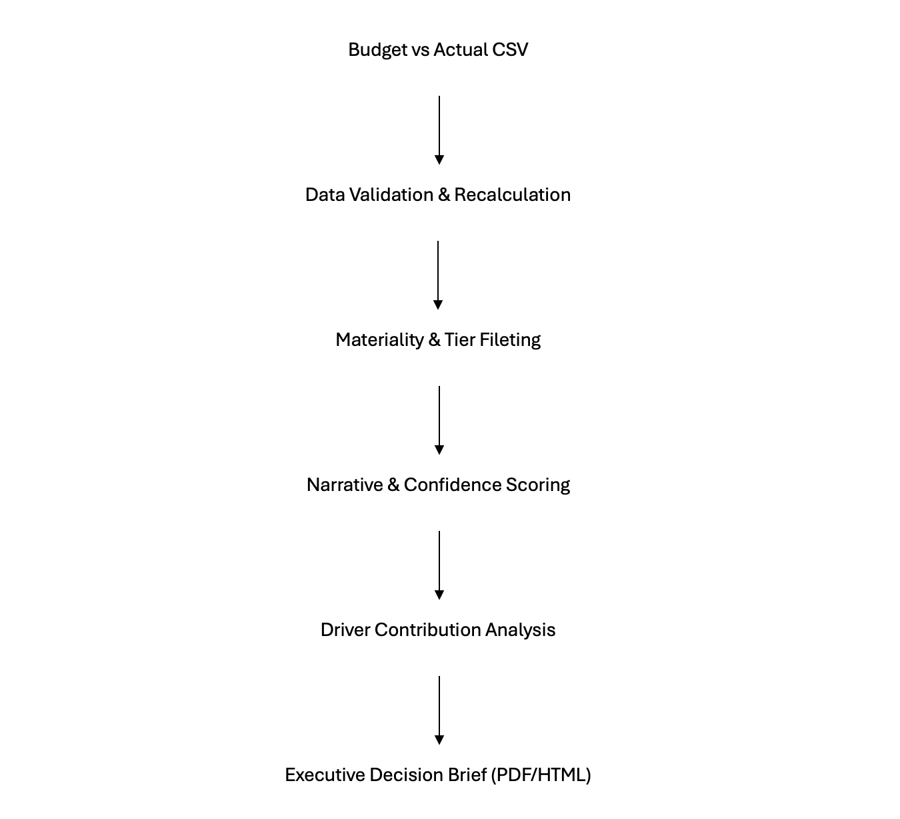

# Decision Brief Generator 
Turning budget data into executive-ready decisions

## Overview
This project takes raw budget vs. actual financial data and converts it into clear, one-page decision briefs designed for senior finance leaders. 

Instead of producing long variance tables and dashboards, the goal is simple:
Identify the single most important issue, explain what happened, why it happened, and how confident we are in that conclusion. 

The output is a short, readable brief that can be reviewed in minutes and used directly in leadership discussions. 

## Why This Project Exists
In many finance terms, variance analysis produces a lot of numbers but very few answers. 

Common problems with traditional variance reports: 
- Too many issues surfaced at once.
- No clear prioritization.
- No explanation of "why" something changed.
- No indication of how confident we should be in the analysis.

This project was built to solve that problem of forcing prioritization and explicitly communicating uncertainty, the same way a senior analyst would brief an executive. 

## How a Finance Leader Would Use This
At the close of a fiscal year (or quarter), a financial leader can run this analysis on finalized budget data to quickly answer:
- What is the most decision-relevant variance this period?
- Is it large enough and important enough to act on?
- What are the main drivers behind it?
- Is this an isolated issue or part of a broader pattern?
- How confident are we in this conclusion?

Each run generates a one-page PDF decision brief that can be:
- Shared in executive meetings.
- Used in budget or treasury discussions.
- Referenced for follow-up analysis or policy review.

No dashboards or technical interpretation required. 

## What Decisions This Enables
This system supports decisions such as:
- Whether an issue requires immediate intervention or monitoring.
- Which spending areas warrant deeper investigation.
- Whether a variance is operational, structural or policy-driven.
- How urgently leadership should engage.
- How confidently findings can be communicated to stakeholders.

The focus is not on predication but on "Decision Clarity."

## How the Analysis Works (High Level) 
The logic follows a clear and defensible sequence: 
1. Data Validation:
   - Variances are recalculated rather than trusted from source files.
   - This ensures consistency and auditability.
2. Materiality and prioritization: 
   - Issues are tiered based on fiscal importance.
   - The single most material issue is selected using magnitude and tier logic.
3. Driver Analysis:
   - Variance contributions are aggregated across categories.
   - The system distinguishes between single-driver and systemic pressure.
4. Narrative Generation:
   - Results are translated into plain-language explanations.
   - "What changed" and "Why it changed" are kept separate intentionally.
5. Confidence Scoring: 
   - Confidence reflects data quality, driver, clarity, and magnitude.
   - Uncertainty is communicated explicitly, not hidden. 

## Repository Structure
decision-brief-generator/
├── data/         # Sample input datasets
├── notebooks/    # Step-by-step analysis and development notebooks
├── src/          # Reusable logic (scoring, drivers, narratives)
├── output/       # Generated decision briefs (PDF / HTML)
└── README.md

## Sample Output
The output/ folder contains exmaple decision breifs for: 
- FY 2023
- FY 2024

Each brief follows the same structure:
- Executive Summary
- What Changed
- Why It Changed
- Recommended Actions
- Confidence and Assumptions

These are intentinally limited to one page to match executive exepctations. 

## Intended Audience
This project is designed for: 
- Finance leaders (CFO, FP&A heads, controllers).
- Senior Analysts supporting executive decision-making.
- Anyone responsible for explaining financial results, not just calculating them.

It is not intended to replace detailed financial models or dashboards. 

### Project Status
The core logic and outputs are complete and stable. 

Future improvements could include: 
- Additional narrative nuance by variance type.
- Quarterly or monthly extensions.
- Integration with automated data pipelines.

The current version is portfolio - ready and demonstrates senior-level analytical judgment. 

## System Architecture
This diagram shows how raw budget data flows through the analysis pipeline and becomes an executive decision brief. 

The system is intentionally designed to separate data validation, analytical judgment, and narrative generation so leaders can trust both the numbers and the story. 

## Final Note
This project was built an emphasis on defensibility, clarity, and decision usefulness rather than technical complexity. 
Every design choice reflects how financial insights are acutally consumed at the leadership level. 
